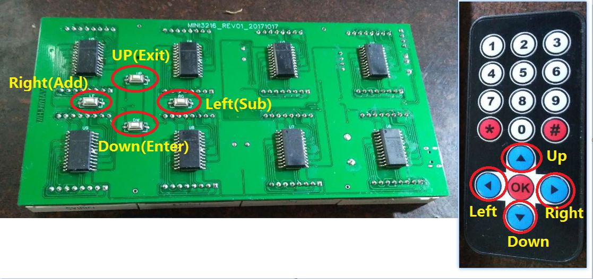
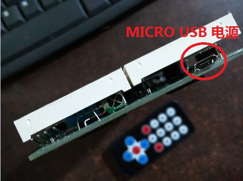
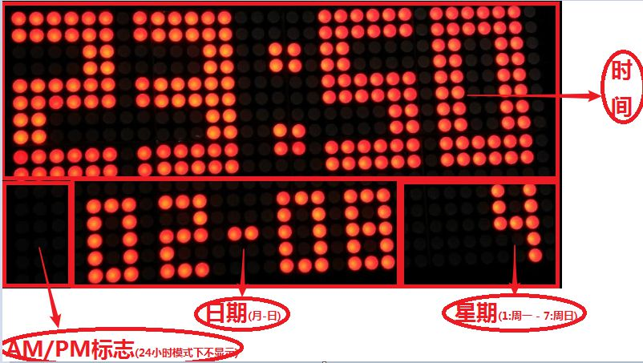
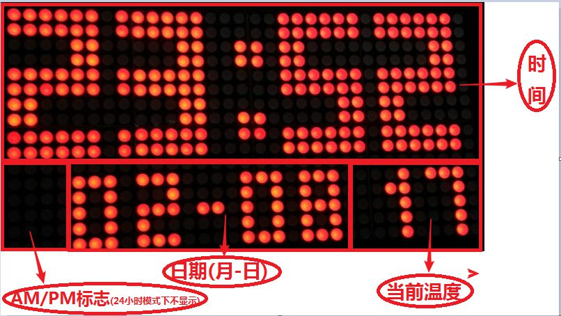
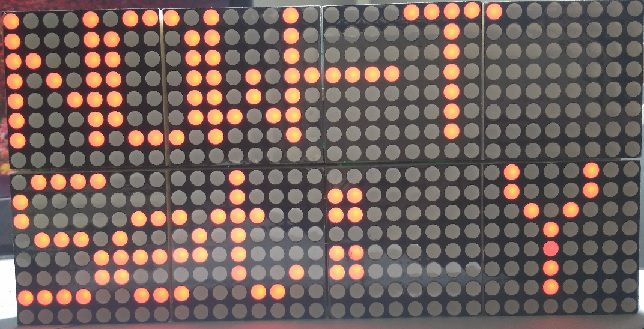
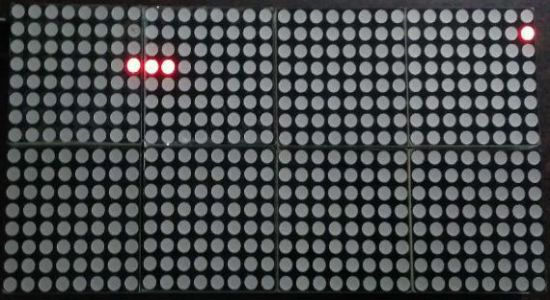
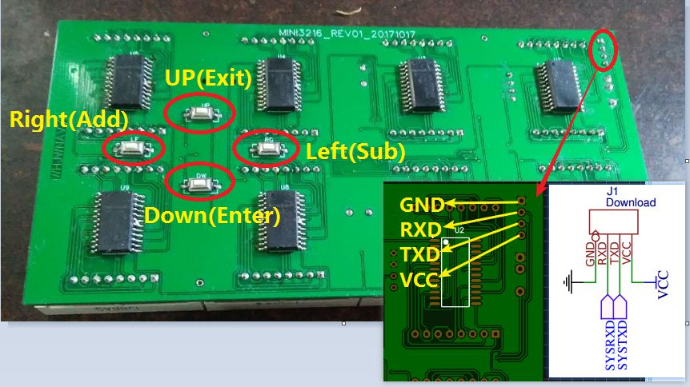
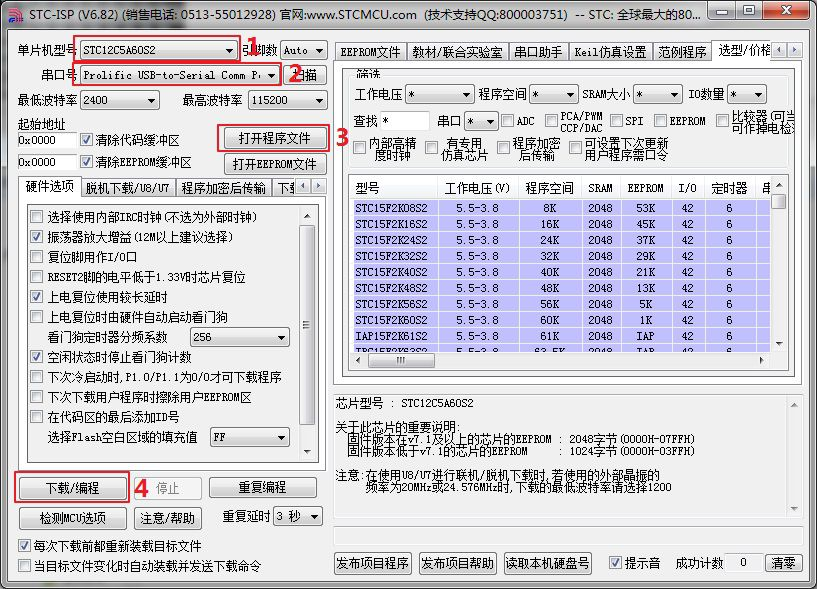

# MINI3216多功能电子钟使用说明书

## 功能说明
- 全自动日历
- 温湿度显示
- 红外遥控按键
- 自动循环闹钟
- 农历查看
- 时间设置
- 日期设置
- 闹钟设置
- 整点报时
- 生日提醒
- 节日提醒
- 农历生日设置
- 24小时制设置
- 勿扰(静音)设置
- 显示亮度设置
- 显示模式设置
- 画面旋转设置
- 软硬件版本查看
- 贪吃蛇小游戏
- 俄罗斯方块小游戏
- 所有设置掉电不丢失
- 主界面下按 ***[UP]*** 键滚动显示日历
- 主界面下按 ***[LEFT]*** 键滚动显示农历
- 主界面下按 ***[RIGHT]*** 键滚动显示温湿度

## 演示视频
[演示视频](http://v.youku.com/v_show/id_XMzM4MTQyMjk1Ng==.html)
[操作视频](http://v.youku.com/v_show/id_XMzQyOTQyODEwNA==.html)

## 按键说明

## 按键功能
| 按键名 | 功能1 | 功能2 |
|:---:|:---:|:---:|
| UP | 上方向键 | 退出 |
| DOWN | 下方向键 | 确定 |
| LEFT | 左方向键 | 减 |
| RIGHT | 右方向键 | 加 |
> ***注意:*** 为了方便正面操作,主板背面的左右键被调换了位置

## 供电接口

本机使用普通 ***microUSB*** 接口供电,只要用一条microUSB线把本机与PC的USB口或者手机的电源适配器相连,即可自动开机.
> ***注意:*** 请不要使用带有快充功能的电源适配器为本机供电!否则有可能会烧毁本机!只能使用5V供电!

## 系统主界面
主界面一共有三种模式,分别如下:
### 模式一(默认模式)

### 模式二

### 模式三

## 菜单界面
### 操作说明
在系统主界面下按 ***[Enter/Down]*** 键即可进入菜单界面,按 ***[Exit/Up]*** 键可以退回到主界面.
按 ***[Left/Sub]*** 和 ***[Right/Add]*** 键可以滚动选择相应功能.
选中之后按 ***[Enter/Down]*** 键即可进入对应的设置界面.
### 图标说明
| 功能 | 图标 |
|:---:|:---:|
| 时间 |  |
| 闹钟 |  |
| 日历 |  |
| 生日 |  |
| 农历 |  |
| 温湿度 |  |
| 系统设置 |  |
| 系统信息 |  |
| 贪吃蛇游戏 |  |
| 俄罗斯方块 |  |

## 时间设置
### 小时调整

按 ***[Left/Sub]*** 和 ***[Right/Add]*** 键可上下调整小时,只能在 ***[0-23]*** 之间调整.调整完之后按 ***[Enter/Down]*** 键进入分钟调整.
> ***注意:*** 小时调整必须使用24小时制时间,与主界面显示模式无关!在所有设置项中按 ***[Exit/Up]*** 键会放弃调整并退出.

### 分钟调整

按 ***[Left/Sub]*** 和 ***[Right/Add]*** 键可上下调整分钟,只能在 ***[0-59]*** 之间调整.调整完之后按 ***[Enter/Down]*** 键进入秒调整.

### 秒调整

按 ***[Left/Sub]*** 和 ***[Right/Add]*** 键可上下调整分钟,只能在 ***[0-59]*** 之间调整.调整完之后按 ***[Enter/Down]*** 键进入保存配置界面.

### 保存设置

按 ***[Left/Sub]*** 和 ***[Right/Add]*** 键可选择是否保存刚才的调整.
如果要保存,选择Y之后按 ***[Exit/Up]*** 键即可退出并保存刚才所有的配置.
如果要放弃保存,选择N并按 ***[Exit/Up]*** 键退出.
> ***注意:*** 所有设置项中的保存界面操作方式都一样!在保存界面中按 ***[Enter/Down]*** 键会转回到小时调整界面.

## 日历设置
### 年调整

按 ***[Left/Sub]*** 和 ***[Right/Add]*** 键可上下调整年,只能在 ***[0-99]*** 之间调整.调整完之后按 ***[Enter/Down]*** 键进入星期调整.

### 周调整

按 ***[Left/Sub]*** 和 ***[Right/Add]*** 键可上下调整星期,只能在 ***[1-7]*** 之间调整.调整完之后按 ***[Enter/Down]*** 键进入月调整.
> ***注意:*** 1代表星期一,7代表星期日,以此类推.(新版已更新,使用英文简写表示)

### 月调整

按 ***[Left/Sub]*** 和 ***[Right/Add]*** 键可上下调整月,只能在 ***[1-12]*** 之间调整.调整完之后按 ***[Enter/Down]*** 键进入日调整.

### 日调整

按 ***[Left/Sub]*** 和 ***[Right/Add]*** 键可上下调整日,只能在 ***[1-31]*** 之间调整.调整完之后按 ***[Enter/Down]*** 键进入保存配置界面.

### 保存设置

操作方式同上.

## 生日设置

> 默认为公历生日，可以在设置中开启农历生日

### 月调整

按 ***[Left/Sub]*** 和 ***[Right/Add]*** 键可上下调整月,只能在 ***[1-12]*** 之间调整.调整完之后按 ***[Enter/Down]*** 键进入日调整.

### 日调整

按 ***[Left/Sub]*** 和 ***[Right/Add]*** 键可上下调整日,只能在 ***[1-31]*** 之间调整.调整完之后按 ***[Enter/Down]*** 键进入保存配置界面.

### 保存设置

操作方式同上.

## 查看农历
### 查看闰月

***Y*** 表示当月是闰月, ***N*** 表示当月不是闰月,按 ***[Enter/Down]*** 键查看农历月.

### 查看农历月

***1-12*** 分别表示农历正月到腊月, 按 ***[Enter/Down]*** 键查看农历日.

### 查看农历日

***1-30*** 分别表示农历初一到三十,按 ***[Exit/Up]*** 键退出.

## 查看温湿度
### 查看温度

按 ***[Enter/Down]*** 键可以继续查看湿度.按 ***[Exit/Up]*** 键即可退出.

### 查看湿度

按 ***[Enter/Down]*** 键可以继续查看湿度.按 ***[Exit/Up]*** 键即可退出.

## 系统设置
### 电源(待机)设置

按 ***[Left/Sub]*** 和 ***[Right/Add]*** 键可上下调整电源选项,只能在 ***[Y-N]*** 之间调整.
选择N并保存之后可以关闭显示,进入待机模式.继续按 ***[Enter/Down]*** 键进入测试模式设置.

### 测试模式

按 ***[Left/Sub]*** 和 ***[Right/Add]*** 键可上下调整测试模式开关,只能在 ***[Y-N]*** 之间调整.
选择Y并保存之后可以开启点阵坏点检测模式.继续按 ***[Enter/Down]*** 键进入亮度设置.
> ***注意:*** 测试模式下点亮屏幕的所有LED会导致功耗增加,此时红外按键会不起作用,必须使用主板背面的任意按键退出测试模式.请勿长时间处于测试模式下!

### 亮度设置

按 ***[Left/Sub]*** 和 ***[Right/Add]*** 键可上下调整亮度,只能在 ***[0-10]*** 之间调整.本机默认亮度为0.
继续按 ***[Enter/Down]*** 键进入主页模式设置.
> ***注意:*** 高亮度会增加功耗,缩短LED寿命,请勿长时间使用较高亮度!

### 主界面模式设置

按 ***[Left/Sub]*** 和 ***[Right/Add]*** 键可上下调主界面模式,只能在 ***[1-3]*** 之间调整.本机默认模式为1.
继续按 ***[Enter/Down]*** 键进入24小时制设置.

### 24小时制设置

按 ***[Left/Sub]*** 和 ***[Right/Add]*** 键可上下调24小时制模式,只能在 ***[Y-N]*** 之间调整.本机默认模式为N,即不使用24小时制.
继续按 ***[Enter/Down]*** 键进入整点报时设置界面.

### 整点报时设置

按 ***[Left/Sub]*** 和 ***[Right/Add]*** 键可调整点报时设置,只能在 ***[Y-N]*** 之间调整.本机默认模式为Y,即开启整点报时.
继续按 ***[Enter/Down]*** 键进入闹钟开关设置界面.

### 闹钟开关设置

按 ***[Left/Sub]*** 和 ***[Right/Add]*** 键可调整闹钟开关,只能在 ***[Y-N]*** 之间调整.本机默认模式为N,即闹钟不开启.
继续按 ***[Enter/Down]*** 键进入农历生日设置界面.

### 农历生日设置

按 ***[Left/Sub]*** 和 ***[Right/Add]*** 键可调整农历生日开关,只能在 ***[Y-N]*** 之间调整.本机默认模式为N,即不开启农历生日.
继续按 ***[Enter/Down]*** 键进入系统静音设置界面.

### 静音(勿扰)模式设置

按 ***[Left/Sub]*** 和 ***[Right/Add]*** 键可开启/关闭静音模式,只能在 ***[Y-N]*** 之间调整.本机默认为不静音.
继续按 ***[Enter/Down]*** 键进入欢迎界面设置界面.

### 欢迎界面设置

按 ***[Left/Sub]*** 和 ***[Right/Add]*** 键可开启/关闭欢迎界面,只能在 ***[Y-N]*** 之间调整.本机默认为显示欢迎界面.
继续按 ***[Enter/Down]*** 键进入画面旋转设置界面.

### 画面旋转设置

按 ***[Left/Sub]*** 和 ***[Right/Add]*** 键可调整界面显示方向,只能在 ***[Y-N]*** 之间调整.本机默认为Y,即画面旋转显示.
继续按 ***[Enter/Down]*** 键进入保存配置界面.

### 保存设置

操作方式同上.

## 系统信息
### 软件版本

按 ***[Enter/Down]*** 键可以继续查看硬件版本.按 ***[Exit/Up]*** 键即可退出.

### 硬件版本

按 ***[Enter/Down]*** 键可以继续查看版本发布时间.按 ***[Exit/Up]*** 键即可退出.

### 发布时间

按 ***[Enter/Down]*** 键可以继续查看客户ID.按 ***[Exit/Up]*** 键即可退出.

### 客户ID

按 ***[Enter/Down]*** 键可以继续查看软件版本.按 ***[Exit/Up]*** 键即可退出.

## 贪吃蛇游戏

在贪吃蛇游戏过程中,使用上下左右方向键控制贪吃蛇移动方向.
使用红外键盘中的数字0键退出游戏, OK键暂停/继续游戏,
数字1键加速,数字2键减速, 数字4键开启无界模式(默认),数字5键关闭无界模式.
> ***注意:*** 由于物理按键太少,无法完全操作游戏,所以已锁定只能通过红外键盘玩贪吃蛇游戏!

## 俄罗斯方块游戏

在俄罗斯方块游戏过程中,使用左右方向键控制方块左右移动,
使用下方向键改变方块形状,使用上方向键退出游戏.
使用红外键盘中的OK键暂停/继续游戏, 数字1键加速,数字2键减速.

## 软件升级方法

本机预留有ISP软件升级接口,可以通过USB转串口线和STC单片机烧录工具对本机系统软件进行升级.
升级接口引脚如下:

升级方法如下:

点击下载之后,把本机的GND,RXD,TXD月USB转串口板的GND,RXD,TXD一一相连,
之后便会自动开始下载程序到单片机,如果遇到无法检测到单片机可以把RXD和TXD连线交换后再试.
